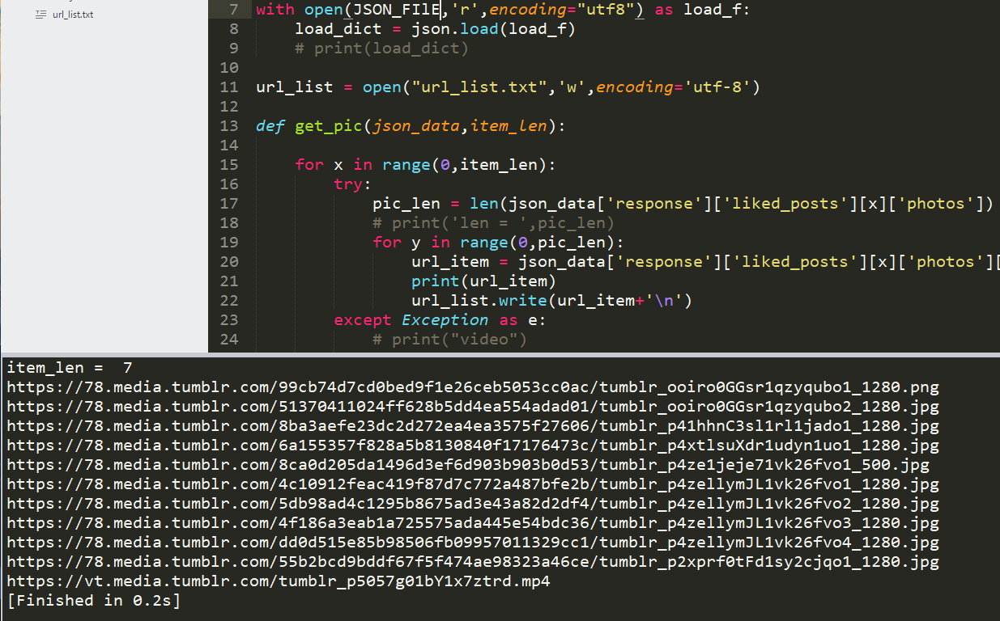

# 一、介绍

本项目使用 python 编写，分析 tumblr 账户中喜欢的内容，给出资源链接，并下载。
其中 `likes.json` 是一份 tumblr 返回的喜欢数据的 json 示例，提取里面图片和视频的资源地址后下载，下载的内容如下图。


# 二、使用方法

## release V1.1
- normal
	- `pip install -r requirements.txt`
	- `python run.py`	
- or
	- `run.exe`

## [release V1.0](https://github.com/cyang812/get_tumblr_likes/releases/tag/V1.0)
- 首先，你需要通过 tumblr API 来获取账户喜欢内容。这个过程是需要通过 OAuth 认证的，具体可参看[这个网页](https://www.tumblr.com/docs/en/api/v2#auth). 具体到这个程序里，就是程序在运行时会给出一个链接，复制该链接到浏览器，点击允许后，网页会自动跳转到一个新的地址，再将这个地址复制，粘贴到程序里，之后便可以通过认证。这个认证只需要执行一次，认证文件便会保存在本地，之后就可以不用在执行认证了。

- 得到认证后,将 consumer_key 和 consumer_secret 填到 `get_json.py` ，之后通过 'python get_json.py' 来获取资源内容，也可以通过[这个网页](https://api.tumblr.com/console/calls/user/likes#)来查询，结果会通过 json 的形式返回

- 返回的 json 数据，命名为`likes.json`，执行命令 `python json_parse.py`，这可以从 json 文件中提取出资源的真正链接，并存为 `url_list.txt` 文件
  

- 执行 `python download.py`，之后资源文件就会挨个下载到 download 文件夹下
  

- 简单来说就是把大象装冰箱的三步：1 `python get_json.py` 2 `python json_parse.py` 3 `download.py`

- `download_thread.py` 是多线程下载，理论上比 `download.py` 要快，因此第三步可以用 `download_thread.py` 下载

- `download_process.py` 也是并发下载，理论上比 `download_thread.py` 要快，因此第三步也可以用 `download_process.py` 下载

# 三、其他

- 由于众所周知的原因，tumblr 的资源地址是不能直接下载的，因此需要设置代理。测试时使用 ssr 代理本地连接，因此 `download.py` 中有 `PROXIES = { "http": "http://127.0.0.1:1080", "https": "https://127.0.0.1:1080" } `，如果是在可直接访问 tumblr 的 VPS 上运行，可对代码做如下修改。
    ```python
    # PROXIES = { "http": "http://127.0.0.1:1080", "https": "https://127.0.0.1:1080" } 
	PROXIES = {}
    ```

- 这个项目下载的是账户中的喜欢内容，因此需要进行认证。如果是下载某个账户发布的内容，可使用[tumblr-crawler](https://github.com/dixudx/tumblr-crawler)，再次感谢 tumblr-crawler 项目